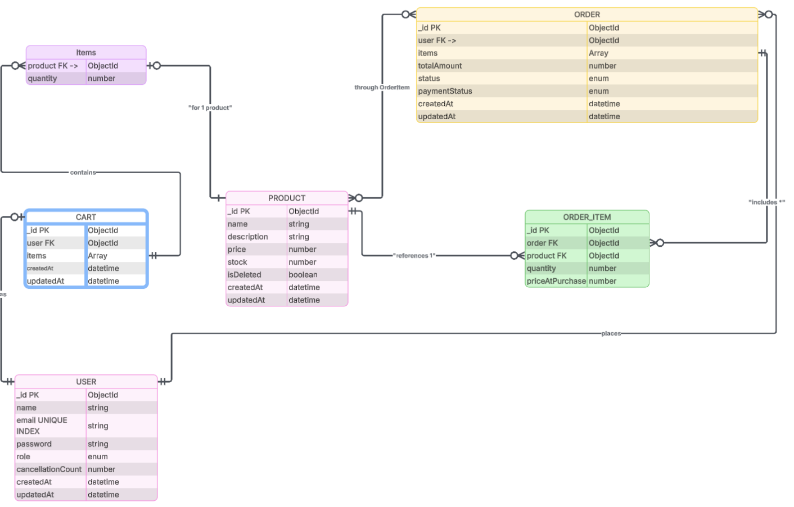

# Mini-API

[Live Demo](https://mini-e-commerce-api-ten.vercel.app/api/v1/)

## Table of Contents

1. [Project Setup Instructions](#project-setup-instructions)
   1. [Clone the repository](#clone-the-repository)
   2. [Install dependencies](#install-dependencies)
   3. [Environment Variables](#environment-variables)
   4. [Run the application](#run-the-application)
2. [Tech Stack Used](#tech-stack-used)
3. [Diagram](#diagram)
4. [Assumptions Made](#assumptions-made)
5. [API Endpoints](#api-endpoints)
   1. [Authentication](#1-authenticationauth)
   2. [Products](#2-products)
   3. [Cart](#3-cart)
   4. [Orders](#4-orders)

## Admin Credentials

```bash
    "email": "appifyDevs@gmail.com",
    "password": "1234",
```

## Project Setup instructions:

open you terminal and follow the below instructions

1. Clone the repository:

```bash
     git clone https://github.com/your-username/mini-ecommerce-api.git
    cd Mini-E-Commerce-API
```

2. Install dependencies:

```bash
    npm install
```

3. Environment Variables:
   Create a .env file in the root directory:

```bash
    PORT=5000
    MONGODB_URI=mongodb_uri
    JWT_SECRET=""
    JWT_EXPIRE=""
    BCRYPT_SALT_ROUNDS=""

```

4. Run the application:

```bash
    npm run start:dev
```

## Tech stack used

- Runtime: Node.js
- Framework: Express.js
- Database: MongoDB (via Mongoose)
- Validation: Zod (via SchemaValidation middleware)
- Pattern: MVC (Models, Views/Routes, Controllers) + Service Layer

## Diagram



## Assumptions made:

- No media or image is needed for now.
- Only product, description , stock and price is there. others are excluding for simplicity.
- Assuming basic product search Functionality. Search product on only name and Description
- Doing Soft delete of product.
- if Product Cancellation Count > 5 then user cant cancel any more. user have to buy the product.

## API Endpoints

### 1. Authentication(/auth)

| Method | Endpoint                  | Access | Description           |
| ------ | ------------------------- | ------ | --------------------- |
| POST   | /api/v1/auth/registration | Public | Register a new user   |
| POST   | /api/v1/auth/login        | Public | Login and receive JWT |

---

### 2. Products

| Method | Endpoint                                  | Access | Description                       |
| ------ | ----------------------------------------- | ------ | --------------------------------- |
| GET    | /api/v1/products                          | All    | Fetch all active products         |
| GET    | /api/v1/product/:productId                | All    | Fetch details of a single product |
| POST   | /api/v1/product/create-product            | Admin  | Add new product to inventory      |
| PATCH  | /api/v1/product/product-update/:productId | Admin  | Update product details/stock      |
| PATCH  | /api/v1/product/product-delete/:productId | Admin  | Soft-delete a product             |

---

### 3. Cart

| Method | Endpoint                       | Access   | Description                    |
| ------ | ------------------------------ | -------- | ------------------------------ |
| GET    | /api/v1/cart                   | Customer | View current items in cart     |
| POST   | /api/v1/cart/add-to-cart       | Customer | Add a product to the cart      |
| PATCH  | /api/v1/cart/update            | Customer | Update item quantity in cart   |
| DELETE | /api/v1/cart/remove/:productId | Customer | Remove specific item from cart |
| DELETE | /api/v1/cart/clear             | Customer | Empty the entire cart          |

---

### 4. Orders

| Method | Endpoint                      | Access         | Description                                          |
| ------ | ----------------------------- | -------------- | ---------------------------------------------------- |
| POST   | /api/v1/order                 | Customer       | Place order (validates stock & clears cart)          |
| GET    | /api/v1/order/my-orders       | Customer       | View personal order history                          |
| GET    | /api/v1/order/:orderId        | Customer       | View specific order details                          |
| PATCH  | /api/v1/order/:orderId/status | Admin/Customer | Update status (Pending/Shipped/Delivered/CANCELLED.) |
